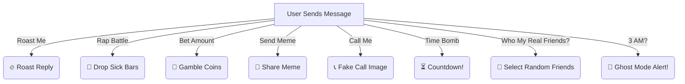
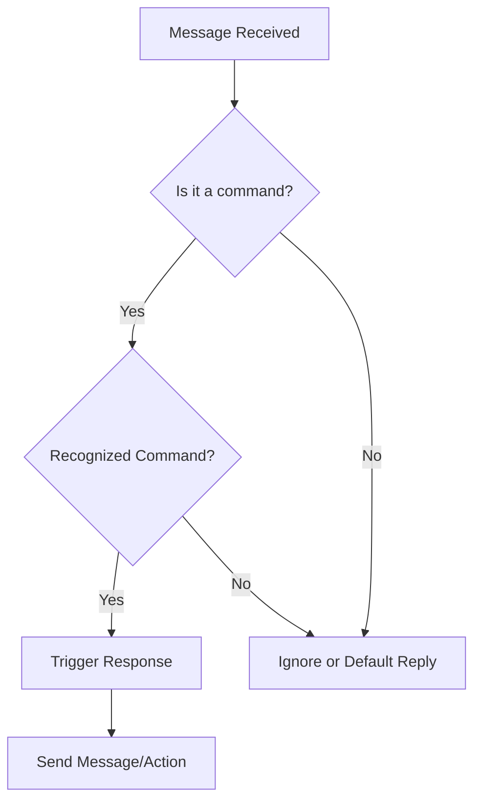

# 🤖 CrazyBot - The Ultimate Fun WeChat Bot


> **A wild, witty, and crazy WeChat bot that roasts, raps, gambles, and even talks like a Mumbaikar!** 🚀

## 🎭 Features

- 🔥 **Roasting** - Get roasted like never before!
- 🎤 **Rap Battles** - Drop some sick bars!
- 🏆 **Betting Game** - Win or lose coins!
- 📷 **Memes** - Get fresh memes anytime!
- 📞 **Fake Call** - Prank your friends!
- 👻 **Ghost Mode** - Spooky surprises at 3 AM!
- 🤝 **Friendship Detector** - Find out your real friends!
- 🤗 **Welcomes New Members** - Auto greets new users in a chat room.

---

## 🛠️ Installation

```bash
# Clone the repository
git clone https://github.com/your-username/CrazyBot.git
cd CrazyBot

# Install dependencies
pip install wechaty

# Run the bot
python bot.py
```

---

## 📝 How It Works

### 🎭 Fun Features Workflow



### 🤖 CrazyBot Decision Tree



---

## ⚡ Commands List

| Command | Action |
|---------|--------|
| `roast me` | 🔥 Get roasted! |
| `rap battle` | 🎤 Drop some bars! |
| `bet <amount>` | 🎲 Win or lose coins! |
| `send meme` | 📸 Get a meme! |
| `call me` | 📞 Fake incoming call! |
| `talk like a mumbaikar` | 🏙️ Mumbai slang! |
| `who my real friends?` | 🤝 Find real friends! |
| `time bomb` | ⏳ 10-sec challenge! |

---

## 📜 License

This project is licensed under the MIT License - see the [LICENSE](LICENSE) file for details.

---

## 💡 Contributing

Pull requests are welcome! For major changes, please open an issue first to discuss what you would like to change.

```bash
# Fork the repository
git fork https://github.com/your-username/CrazyBot.git

# Create a new branch
git checkout -b feature-branch

# Make your changes and commit
git commit -m "Your awesome feature!"

# Push to your fork
git push origin feature-branch

# Open a Pull Request 🎉
```

---

## 🔥 Created by

👨‍💻 **Sahil Candan Pandey**  
🚀 Passionate Developer | Tech Enthusiast | AI & Bots Lover  
📫 Connect with me: [GitHub](https://github.com/your-username) | [LinkedIn](https://linkedin.com/in/your-profile)  

---

Enjoy using CrazyBot? Give this repo a ⭐ and share with your friends! 🚀
